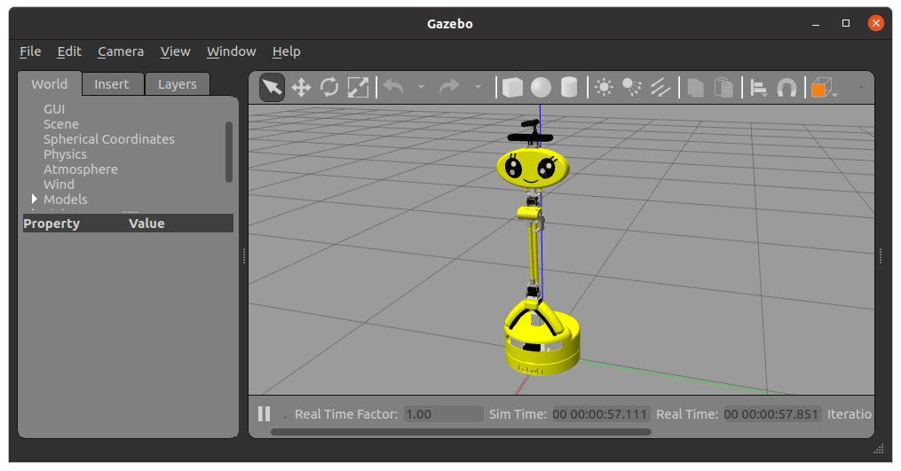
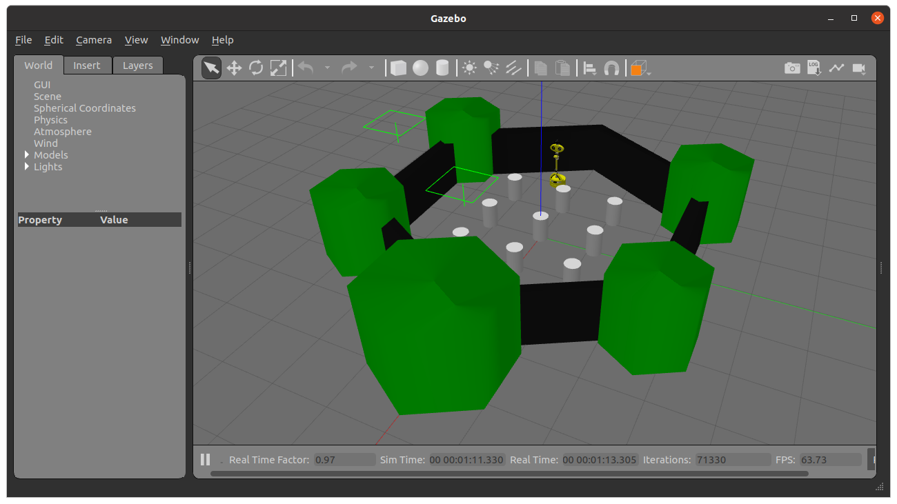
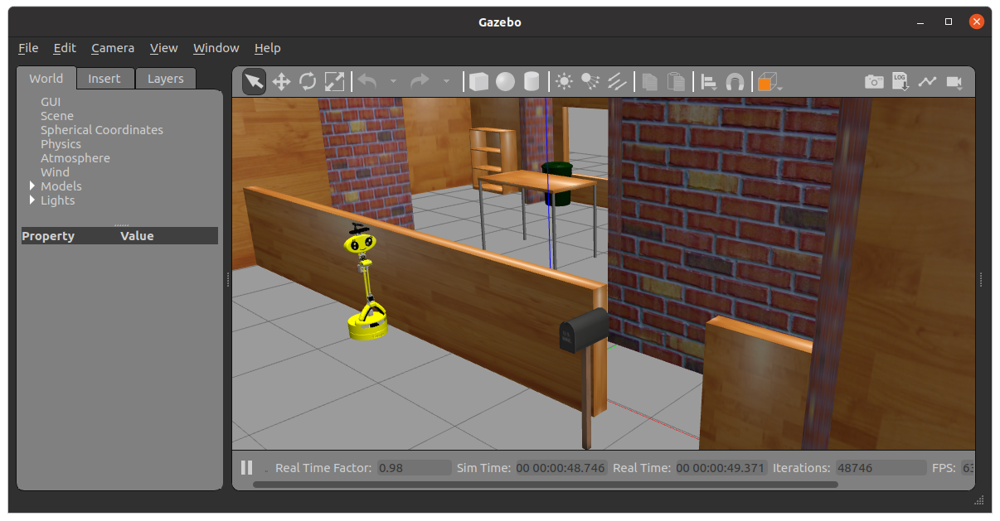

# Happy Miniのシミュレーション

[オリジナルのREADME](README_original.md)

## 概　要

- [TurtleBot3のシミュレーション](https://github.com/ROBOTIS-GIT/turtlebot3_simulations)の
[humbleブランチ](https://github.com/ROBOTIS-GIT/turtlebot3_simulations/tree/humble)からフォークして
Happy Miniのモデル（URDF, Mesh）を追加して，シミュレーションできるようにしました．
ロボット台車のパラメータはwaffle_piと同じです．

## 追加・変更箇所
- [turtlebot3_gazebo/models/turtlebot3_happy_mini]()
- [turtlebot3_gazebo/urdf/turtlebot3_happy_mini.urdf]()
- [turtlebot3_gazebo/launch/spawn2_turtlebot3.launch.py]()
- [turtlebot3_gazebo/launch/turtlebot3_house2.launch.py]()

## 環　境  
- ROS2 Humble

## インストール  
- GazeboをROSで使うためのパッケージのインストール
```
$ source ~/.bashrc
$ sudo apt -y install ros-humble-gazebo-*
$ sudo apt -y install ros-humble-gazebo-ros-pkgs
```
- Happy Mini関連パッケージのインストール
```
$ cd ~/airobot_ws/src
$ git clone -b humble https://github.com/ROBOTIS-GIT/turtlebot3
$ git clone -b humble https://github.com/ROBOTIS-GIT/turtlebot3_msgs
$ git clone https://github.com/AI-Robot-Book-En/turtlebot3_simulations
$ cd ~/airobot_ws
$ colcon build
$ source install/setup.bash
```


## 実行
1. Empty World  


```
$ export TURTLEBOT3_MODEL=happy_mini
$ ros2 launch turtlebot3_gazebo empty_world.launch.py
```

2. TurtleBot3 World  

```
$ export TURTLEBOT3_MODEL=happy_mini
$ ros2 launch turtlebot3_gazebo turtlebot3_world.launch.py
```

3. TurtleBot3 House

```
$ export TURTLEBOT3_MODEL=happy_mini
$ ros2 launch turtlebot3_gazebo turtlebot3_house.launch.py
```
4. ロボットモデルの変更
- Waffle Piを使う場合
```
$ export TURTLEBOT3_MODEL=waffle_pi
```

5. ロボット初期位置の変更方法
```
$ ros2 launch turtlebot3_gazebo turtlebot3_house.launch.py　x_pose:=初期位置のx座標 y_pose:=初期位置のy座標
```

6. ロボット初期姿勢の変更方法  
turtlebot3_house.launch.pyで初期向きを設定できるように改良したturtlebot3_house2.launch.pyを使ってください．  

```
$ ros2 launch turtlebot3_gazebo turtlebot3_house2.launch.py　x_pose:=初期位置のx座標 y_pose:=初期位置のy座標 yaw_pose:=初期向きのYaw角
```

## 履歴
- 2024-10-13: 初期版

## ライセンス
Apache License 2.0 license found in the LICENSE file in the root directory of this project.


## 参考文献
- 今のところありません
